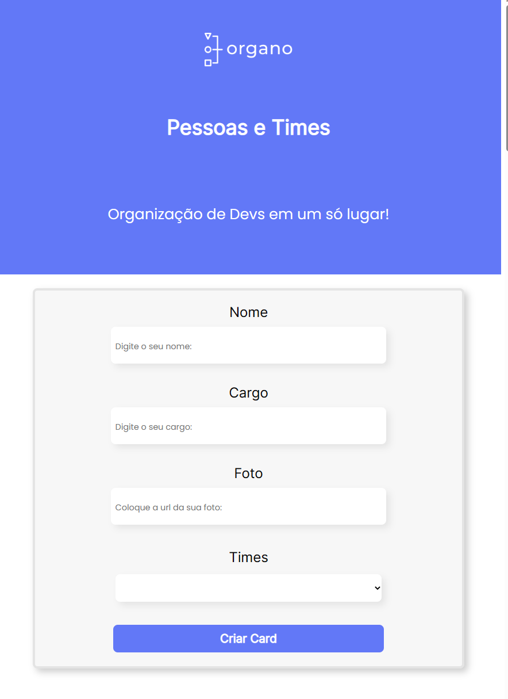

# Alura Colaborators @alura

Projeto desenvolvido em guia pela Alura, num framework React, para se entender as fundamentos base do frame JS, e assim conseguir utilizálo em suas melhores funções. **Este projeto logo será passado para o *TypeScript* também!** 

---

## Projeto Figma:

Você que quer desenvolver sua versão do projeto, venha acessar seu link do figma!

[Link do Figma](https://www.figma.com/file/T6BLI1HfB81eYOiVgpqQz7/Projeto-Intro-ao-React?node-id=134%3A128&t=9fLul78KkZPz4xjp-0)

---
